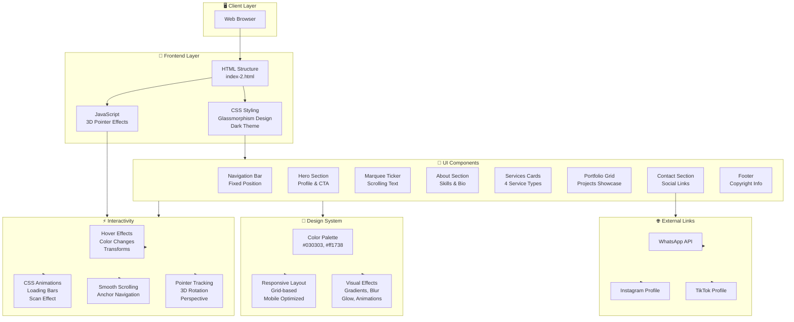

# ALIRMAZAN Portfolio - Architecture Overview

## System Architecture Diagram



## Technology Stack

| Layer | Technology | Purpose |
|-------|-----------|---------|
| **Frontend** | HTML5 | Semantic structure & content |
| **Styling** | CSS3 | Design, animations, responsive layout |
| **Interactivity** | Vanilla JavaScript | 3D pointer effects, dynamic behavior |
| **Design Pattern** | Glassmorphism | Modern, translucent UI elements |
| **Responsive** | CSS Grid/Flexbox | Mobile-first design |

## Key Features

### 🎯 Navigation
- Fixed navbar with smooth scroll behavior
- Links to: Home, About, Services, Portfolio, Contacts
- Responsive menu with backdrop blur effect

### 👤 Hero Section
- Profile introduction with dynamic text
- Call-to-action buttons (Services, Portfolio)
- Professional photo with 3D perspective effect
- Animated scan line effect
- Skill badge overlay

### 🔄 Marquee Ticker
- Continuous scrolling text animation
- Professional services showcase
- Infinite loop animation

### 📊 Core Sections

#### 1. About
- Professional bio
- Skills with animated progress bars
  - Web Development: 90%
  - SMM Marketing: 85%
  - Video Editing: 88%
  - IT Support: 80%

#### 2. Services
- 4 service cards in grid layout
  - **Web Development** - Websites, interactive pages, automation
  - **SMM** - Social media promotion and content creation
  - **Мобилография** - Mobile video shooting and editing
  - **IT Support** - Setup, repair, consultation, digital solutions

#### 3. Portfolio
- 4 portfolio items showcase
  - Web Experience
  - Content Creation
  - 3D/Motion Design
  - Digital Solutions

#### 4. Contacts
- Social media links (3 columns)
  - WhatsApp
  - TikTok (@nxe.738)
  - Instagram (@alirmazan_2007)

### ✨ Visual Effects

#### Background Effects
- Radial gradients with red accent (#ff1738)
- Grid pattern overlay
- Dark theme (#030303)

#### Interactive Effects
- Backdrop blur on navigation
- Glow effects on hover
- 3D rotation on pointer movement
- Smooth transitions and animations
- Transform effects on card hover

#### Animations
- Scan line animation (4s loop)
- Loading bar animations (1.5s)
- Marquee scroll animation (22s)
- Smooth scroll behavior

### 📱 Responsive Design

| Breakpoint | Layout |
|-----------|--------|
| **Desktop (900px+)** | 4-column grid, 2-column layout |
| **Tablet (600px-900px)** | 2-column grid, single column sections |
| **Mobile (<600px)** | Single column, optimized spacing |

## Component Breakdown

### Navigation Component
```
Fixed Position
├── Logo: "ALIRMAZAN / IT SPECIALIST"
└── Nav Links: [ГЛАВНАЯ, ОБО МНЕ, УСЛУГИ, ПОРТФОЛИО, КОНТАКТЫ]
```

### Card Component
```
Reusable Card
├── Icon (emoji or number)
├── Title (h3)
└── Description (p)
```

### Skill Bar Component
```
Skill Progress Bar
├── Label & Percentage
└── Animated fill bar
```

### Social Link Component
```
Social Media Link
├── Platform Name (WhatsApp, TikTok, Instagram)
└── Handle/Description
```

## File Structure

```
alirmazan-portfolio/
├── index-2.html           # Main portfolio page
├── profile.png            # Profile photo
├── ARCHITECTURE.md        # This file
└── README.md             # Documentation
```

## Browser Compatibility

- ✅ Chrome (latest)
- ✅ Firefox (latest)
- ✅ Safari (latest)
- ✅ Edge (latest)
- ⚠️ IE 11 (not supported - modern CSS required)

### Required Features
- CSS Grid & Flexbox support
- CSS Animations & Transitions
- JavaScript ES6+ features
- Backdrop filter support (for blur effects)
- Transform & Perspective support

## Performance Considerations

1. **CSS-only Animations** - No JavaScript for simple animations
2. **Smooth Scrolling** - Native browser behavior
3. **Lazy Loading** - Image optimization recommended
4. **Mobile-first** - Progressive enhancement approach
5. **No External Dependencies** - Pure HTML/CSS/JS

## Color Palette

| Color | Hex | Usage |
|-------|-----|-------|
| Dark Background | `#030303` | Main background |
| Red Accent | `#ff1738` | Highlights, borders, glows |
| Light Gray | `#bbb`, `#aaa` | Text, secondary elements |
| Card Border | `#261016`, `#281017` | Card borders |
| Glow Red | `#ff1738` (with opacity) | Box shadows, effects |

---

**Portfolio for**: ALIRMAZAN - IT Specialist, SMM, Мобилографер  
**Location**: Шымкент 🇰🇿  
**Repository**: https://github.com/veonnoppo-del/alirmazan-portfolio
